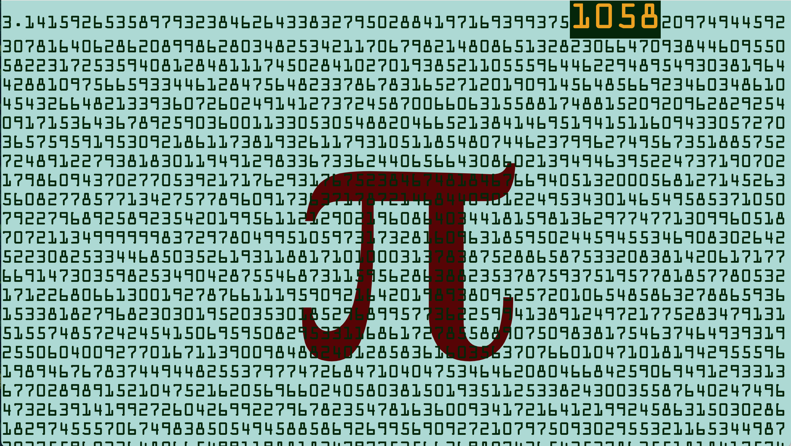

# pi-clock (&pi; clock)
This is a clock based on the digits of &pi;.

It searches for the current time within the first 100,000 digits of Pi 3.14159... and makes the number big and bold for you to see.

### The time is now 10:58

## Run the Web Server

From the command line of your computer you can run this:

  python3 -m http.server 80

## Browser Links

If you start the http server enter the following link in your browser:

  http://localhost/

Or you can simply open the file index.html from you browser.  No need to start the http server with python.

## Javascript

The application is written entirely in javascript.  The function currentTime() is scheduled to run once a second.

When it notices the a time change (hours and minutes):
1. It looks into a table for the location of four digits of Pi corresponding to the current time.
2. It highlights those digits with a new color and bigger size
3. Then it scrolls to make it visible.  100,000 digits makes a big webpage.  The program makes it easy for you.

## Python tools

The python script tools/searchpi.py only exists for your reference.  It does not need to be installed for the webpage to work.  This is script I used to search through the digits of Pi for all the hours+minutes of the day.   The output is formatted as a javascript dictionary that can be use as data in the webpage.

The file piclockdata.js was created like this:

  python3 searchpi.py > piclockdata.js

You don't need to do this yourself.  The file piclockdata.js already exists for you to use.

## Credits

The data comes from this file at angio.net:

    https://assets.angio.net/pi1000000.txt

## TODO

### seconds
I'd like to show seconds by highlighting digits scattered around the current hour/minute time.  
1. Add some functionality to searchpi.py to populate the 60 more values in each row of the data dictionary.
2. use the data in piclock.js  (without scrolling).  Something like this:
   
   secondsOffset = piClockData[timeString][seconds+1]

### 24 or AM/PM

The clock type is configured with the variable isClock12.  Set it to true for a 12-hour clock (AM/PM).  Set it to false for a 24-hour clock.

It would be better to enable a urls like this:

- http://localhost/12
- http://localhost/24

