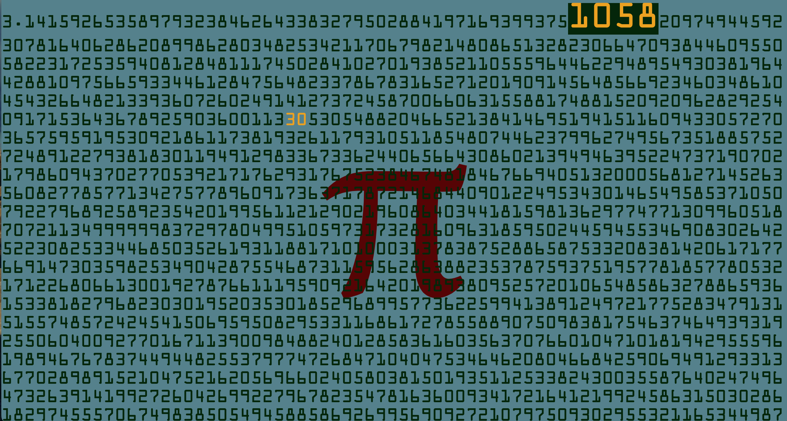
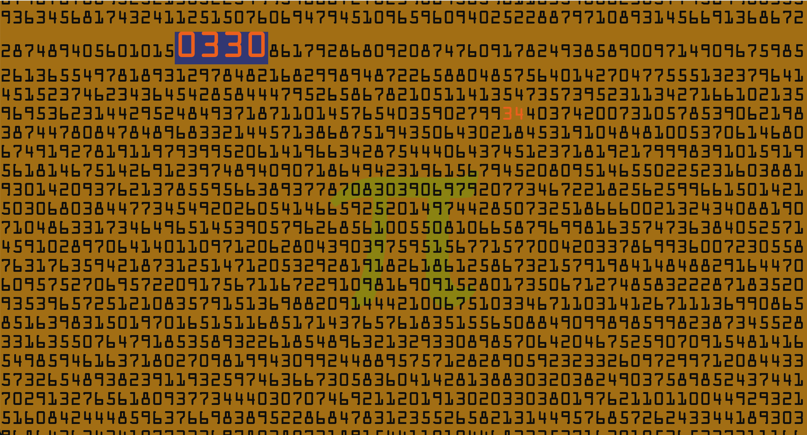

# pi-clock (&pi; clock)
This is a clock based on the digits of &pi;.

It searches for the current time within the first 100,000 digits of Pi 3.14159... and makes the number big and bold for you to see.

### 12:36


## Run the Web Server

From the command line of your computer you can run this:

  python3 -m http.server 80

## Browser Links

If you start the http server enter the following link in your browser:

  http://localhost/

Or you can simply open the file index.html from you browser.  No need to start the http server with python.

## parameters

The webpage can take parameters if you want to customize:

### clock-type

#### Possible values

- clock-type=12  gives you a 12-hour clock (AM/PM)
- clock-type=24  gives you a 24-hour clock

#### Example

http://pi-clock.local?clock-type=24


### show-seconds

#### Possible values

- show-seconds=no  don't highlight the seconds in nearby digits of pi
- show-seconds=yes (default) show seconds

#### Examples

http://pi-clock.local?show-seconds=no

http://pi-clock.local?clock-type=24&show-seconds=no


## Javascript

The application is written entirely in javascript.  The function currentTime() is scheduled to run once a second.

When it notices the a time change (hours and minutes):
1. It looks into a table for the location of four digits of Pi corresponding to the current time.
2. It highlights those digits with a new color and bigger size
3. Then it scrolls to make it visible.  100,000 digits makes a big webpage.  The program makes it easy for you.

## Python tools

The python script tools/searchpi.py only exists for your reference.  It does not need to be installed for the webpage to work.  This is the script I used to search through the digits of Pi for all the hours+minutes of the day.   The output is formatted as a javascript dictionary that can be use as data in the webpage.

The file piclockdata.js was created like this:

  python3 searchpi.py > piclockdata.js

You don't need to do this yourself.  The file piclockdata.js already exists for you to use.

## Themes

Color schemes are defined in colors.js.  Every hour a (sometimes) new theme is randomly selected.  Also, if you have a keyboard attached, you can hit CTRL-F5 (aka refresh).  It will randomly pick another color scheme.

I found this to be a great website to help pick color schemes:

https://color.adobe.com/trends

### Architecture


### Gnome


### Pi Day

(Pi time is a special time every single day.  3:14 shows up bigger than any other time of the day.)


### Botanico


### Pi Clock

Colors based on the PLA I used in printing my case:


## Installation on Raspberry Pi

Obviously the best possible computer to run this clock is on a Raspberry Pi!  It runs well on A Raspberry Pi 3, 4, and 5.  (The Pi Zero is not powerful enough to run a browser).

### Note on Compatibility:
 Mostly I tested this on a Raspberry Pi 5.  I've made some changes that *should* work on the earlier versions but I may not have revisited the older versions or Raspberry Pi.  If you run into an error, please create an issue and I will make sure to address it.

### Touchscreen
A 7-inch touchscreen display is a great option but any HTML monitor will work.  Touch screen or mouse is optional but recommended.  It is fun to scroll up adn down through the 100,000 digits of Pi.

### Default Install Fully Converts the Pi to a Clock
I created a script to convert your Raspberry Pi to a dedicated pi-clock.  But there are enough options so you can also minimize the installation if you prefer.


### Fresh SD Card with Pi OS

Install the default Pi OS on a new SD Card according to the instructions here:

https://www.raspberrypi.com/software/


Use these values when asked:

- hostname: pi-clock
- user name: pi

Connect to the WiFi or plug in an Ethernet cable so you can access the internet.

### Download the code from GitHub

After the Pi OS is up and running.  Open a terminal and run these commands:

```
cd /home/pi/
git clone https://github.com/mhirst1960/pi-clock.git

```
Then go into the installation directory:

```
cd pi-clock/raspberrypi-init
```

### Get Help

The command to install is this: ./install.sh

The option --help shows you a cheat-sheet of possibilities.

```
./install.sh --help

Usage: ./install.sh [--style 12|24] [--no-http] [--no-splash] [--no-wallpaper] [--keep-trash] [--keep-mounts]

All arguments are optional here is a summary:
  -h, --help           show this help message
  --style              12 = 12-hour clock, 24 = 24-hour clock
  --no-screensaver     do not automatically show Pi clock full screen
  --no-httpserver      do not install http server
  --no-splash          do not install custom boot splash screen
  --no-wallpaper       do not install Pi wallpaper
  --no-fonts           do not install ocr-a font
  --keep-trash         do not hide the trashcan icon
  --keep-mounts        do not hide sdcard mount icons
  --no-autohide-cursor do not automatically hide the mouse cursor on timeout
  --no-extras          do not modify: splash screen, wallpaper, desktop icons
```

Note: When you run the script it will always show you what will be installed thn ask you to verify.  If you answer 'n" then it will exit without actually doing anything at all.

### Defaults

By default the script will update your Raspberry Pi with a new picture (Pi) when it boots, and a new backdrop (a different picture of Pi).  It will set things up so the clock is displayed in full screen kiosk mode.

Note: to exit the clock from kiosk mode, connect a keyboard and type "CTRL-F4".  That means hold down the Control key while pressing the F4 key.  You will then have full access to the desktop.

By default the clock shows time in 12-hour format (am/pm).  If you want 24-hour format use the option "--style 24"

By default it starts an HTTP server (aka a website in your home).  If you don't want this, just add "--no-httpserver" to you list of arguments.

So if you run it with no arguments you get this:

```
./install.sh

install http server        = y
auto-start browser         = y
clock style                = 12
Pi splash screen on boot   = y
Pi desktop                 = y
Additional Fonts           = y
hide trashcan icon         = y
hide sdcard mounts icons   = y
autohide mouse cursor      = y

Timezone=America/New_York
Current time: 11:54:21 PM

Is configuration good? [Y or N] n  
```

Maybe you don't want that.  Just answer with 'n' (aka no) and the script will exit without doing anything.

Maybe you want to show 24-hour time.  So run it like this:

```
./install.sh --style 24

install http server        = y
auto-start browser         = y
clock style                = 24
Pi splash screen on boot   = y
Pi desktop                 = y
Additional Fonts           = y
hide trashcan icon         = y
hide sdcard mounts icons   = y
autohide mouse cursor      = y

Timezone=America/New_York
Current time: 23:54

```

Or maybe you also don't want to start the HTTP server:

```
/install.sh --style 24 --no-httpserver

install http server        = n
auto-start browser         = y
clock style                = 24
Pi splash screen on boot   = y
Pi desktop                 = y
Additional Fonts           = y
hide trashcan icon         = y
hide sdcard mounts icons   = y
autohide mouse cursor      = y

Timezone=America/New_York
Current time: 23:57
```


## Credits

The data comes from this file at angio.net:

    https://assets.angio.net/pi1000000.txt


